# ПТМК Test task

## Task description

Write a console application or php script that will run from the console. For each item, it must accept a command-line parameter and execute the corresponding item. There will be examples in the course of the task. Use English for the full name. There is no need to solve the problem with displaying the Russian language in the console, if it occurs. The application/script must connect to the database.

Any SQL DBMS or MongoDB can be used as a DBMS. You can use any programming language you know as a development environment.

The application should have:

1. Creating a table with fields representing full name, date of birth, gender. Application launch example:

```console
   MyApp 1
```

For php:

```console
php myApp.php 1
```

For java:

```console
java myApp.class 1
```

or

```console
java myApp.jar 1
```

2. Create a record. Use the following format:
   MyApp 2 Full name Date of birth Gender

3. Output all lines with a unique value of FULL name + date, sorted by full name, output full name, Date of birth, gender, number of full years. Application launch example:

```console
MyApp 3
```

4. Filling in 1,000,000 lines automatically. The distribution of gender in them should be relatively uniform, the initial letter of the full name as well. Filling in automatically 100 lines in which the gender is male and the full name begins with "F". Application launch example:

```console
MyApp 4
```

5. The result of sampling from the table according to the criterion: male gender, full name begins with "F". Make a measurement of the execution time. Application launch example:

```console
MyApp 5
```

The output of the application must contain the time.

6. Perform certain manipulations on the database to speed up the query from point 5. Make sure that the execution time has decreased. Explain the meaning of the actions performed. Provide the measurement results before and after.

Please use utf8 encoding for any text files.

## Compiling

### GNU GCC

You can use './autoconf.sh' bash script for compile this project. This script compiles source files separately with GNU GCC compiler with necessasry flags and c++ standard. Project uses ranges and their algorithms from [C++20 Standard](https://en.cppreference.com/w/cpp/20). Code example:

```cpp
bool Person::isSurnameNameOrPatronymicValid(const std::string &s) const
{
    // Surname, name or patronymics can't contains punctuation symbols, special symbols or digits
    // and all of first letters have to be in uppercase
    return std::ranges::none_of(s, [](const auto &ch)
                                { return std::ispunct(ch) || std::isdigit(ch); }) &&
           std::isupper(*std::cbegin(s)) &&
           std::isupper(s.at(s.find_first_of(' ') + 1)) &&
           std::isupper(s.at(s.find_last_of(' ') + 1));
}
```

Copy following commands to compile this project manually:

```console
gcc -c include/sqlite-amalgamation-3071300/sqlite3.c -lm -ldl -lpthread -std=c17 -fPIC -O2 -Wno-return-local-addr -o sqlite3.o
gcc -c src/db_manip.cpp -lstdc++ -std=c++20 -Wall -Wpedantic -Wextra -o db_manip.o
gcc -c src/person.cpp -lstdc++ -std=c++20 -Wall -Wpedantic -Wextra -o person.o
gcc -c main.cpp -lstdc++ -std=c++20 -Wall -Wpedantic -Wextra -o main.o
gcc sqlite3.o db_manip.o person.o main.o -lstdc++ -std=c++20 -Wall -Wpedantic -Wextra -o main
rm *.o
```

### CMake

There is autoassembly file 'CMakelists.txt' that describes how this project compiles. To use it you should write following lines:

```console
cmake .
cmake --build .
```

or

```console
cmake .
make
```

#### Terminal output

```console
<loveit@fedora ПТМК>$ cmake .
-- The C compiler identification is GNU 12.2.1
-- The CXX compiler identification is GNU 12.2.1
-- Detecting C compiler ABI info
-- Detecting C compiler ABI info - done
-- Check for working C compiler: /usr/bin/cc - skipped
-- Detecting C compile features
-- Detecting C compile features - done
-- Detecting CXX compiler ABI info
-- Detecting CXX compiler ABI info - done
-- Check for working CXX compiler: /usr/bin/c++ - skipped
-- Detecting CXX compile features
-- Detecting CXX compile features - done
-- Configuring done (0.9s)
-- Generating done (0.0s)
-- Build files have been written to: {$PATH}/ПТМК
<loveit@fedora ПТМК>$ make
[ 20%] Building C object CMakeFiles/main.dir/include/sqlite-amalgamation-3071300/sqlite3.c.o
[ 40%] Building CXX object CMakeFiles/main.dir/src/person.cpp.o
[ 60%] Building CXX object CMakeFiles/main.dir/src/db_manip.cpp.o
[ 80%] Building CXX object CMakeFiles/main.dir/main.cpp.o
[100%] Linking CXX executable main
[100%] Built target main
```

## Examples of usage

This is C++ console application which is use arguments passed into 'main()' function. So, if you just write:

```console
./main
```

after compile project, you will get next output from program:

```console
<loveit@fedora ПТМК>$ ./main
Error: Command: "./main " is unknown command
Run ./main with any of help agruments: "--h"; "-h"; "--help"; "-help"
```

### Help

To print help of this application, you need to write './main' with any one helper flags.
Helper flags are: "--h"; "-h"; "--help"; "-help"

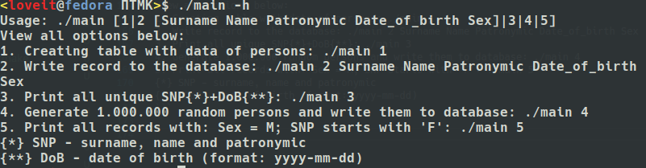

### Mode 1

#### Creating to sqlite database and creating table of a person

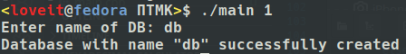

### Mode 2

#### Writing user's record to database

As you can see in screenshot below, user can't write anything to the fields of the 'Person' class, that is, the class processes input for validity.

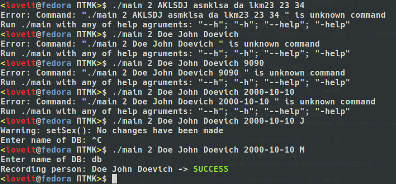

You can use [sqlite online viewer](https://sqliteonline.com/) to make online queries. Result of adding new person:


Adding new person to also filled database:
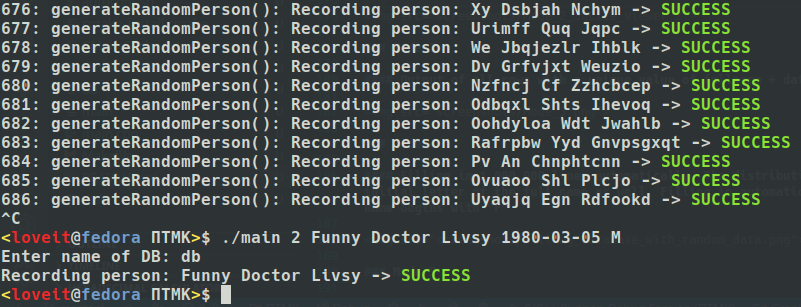
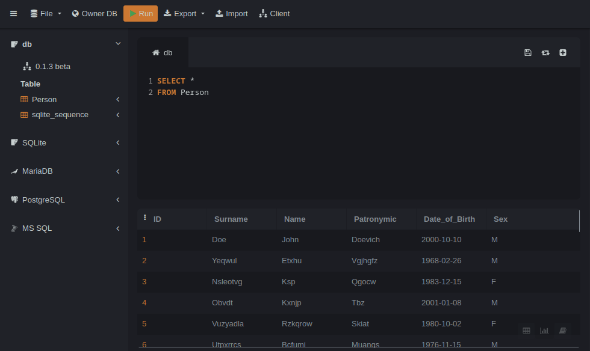
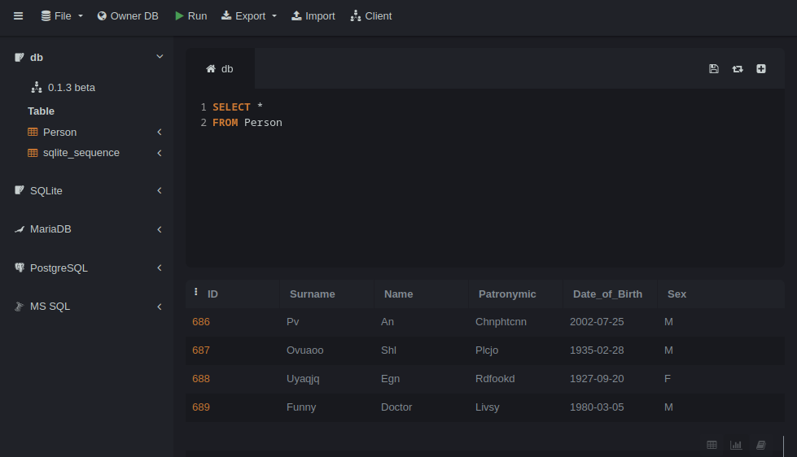

### Mode 3

#### Output of all rows with a unique value of fullname + date, sorted by fullname


### Mode 4

#### Filling in 1,000,000 lines automatically. The distribution of gender in them should be relatively uniform, the initial letter of the full name as well. Filling in automatically 100 lines in which the gender is male and the full name begins with "F"

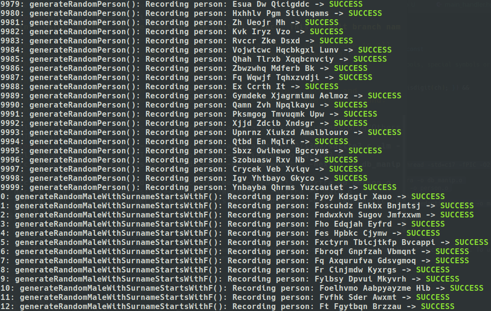

### Mode 5

#### Результат выборки из таблицы по критерию: пол мужской, ФИО начинается с "F". Сделать замер времени выполнения.

Mode 5 uses more complex and slowest SQL query with subquery:

```sql
SELECT * FROM (SELECT *
               FROM Person
               WHERE substr(Surname, 1, 1) == 'F'
               ORDER BY Sex DESC)
WHERE Sex != 'F'
```

```cpp
void DBmanip::printMalePersonWithSurnameFstLetterF()
{
    m_query = "SELECT * FROM (SELECT * " +
              std::string("FROM Person ") +
              std::string("WHERE substr(Surname, 1, 1) == 'F' ") +
              std::string("ORDER BY Sex DESC) ") +
              std::string("WHERE Sex != 'F'");
    char *err = nullptr;
    std::chrono::high_resolution_clock::time_point start{std::chrono::high_resolution_clock::now()};
    execSqlQuery(m_db_handler, m_query.c_str(), &printPersonsFromDB, 0, &err);
    printExecutionTime(start);
    if (err != nullptr)
        sqlite3_free(err);
}
```

Execution time = 27.7749ms

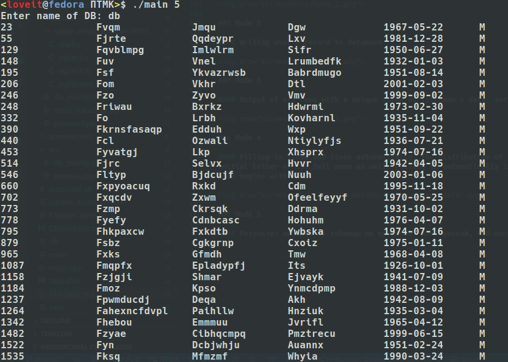
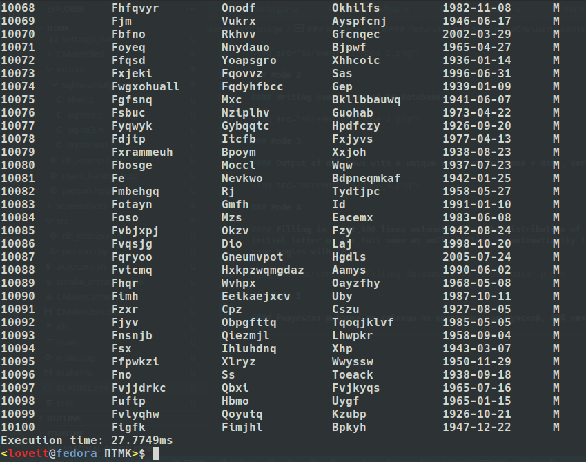

To implement more quickly [method](https://www.bigscal.com/blogs/database-technology/top-10-tips-to-improve-sql-query-performance/), the simplest way is do not use '\*' in query, and simplify your sql query - write it without subexpressions and write as many restrictive conditions as possible, as follows:

```sql
SELECT ID, Surname, Name, Patronymic, Date_of_Birth, Sex
FROM Person
WHERE Sex == 'M' AND substr(Surname, 1, 1) == 'F'
```

```cpp
void DBmanip::printMalePersonWithSurnameFstLetterF_quick()
{
    m_query = "SELECT ID, Surname, Name, Patronymic, Date_of_Birth, Sex " +
              std::string("FROM Person WHERE Sex == 'M' AND substr(Surname, 1, 1) == 'F'");
    char *err = nullptr;
    std::chrono::high_resolution_clock::time_point start{std::chrono::high_resolution_clock::now()};
    execSqlQuery(m_db_handler, m_query.c_str(), &printPersonsFromDB, 0, &err);
    printExecutionTime(start);
    if (err != nullptr)
        sqlite3_free(err);
}
```

Execution time = 10.4508ms

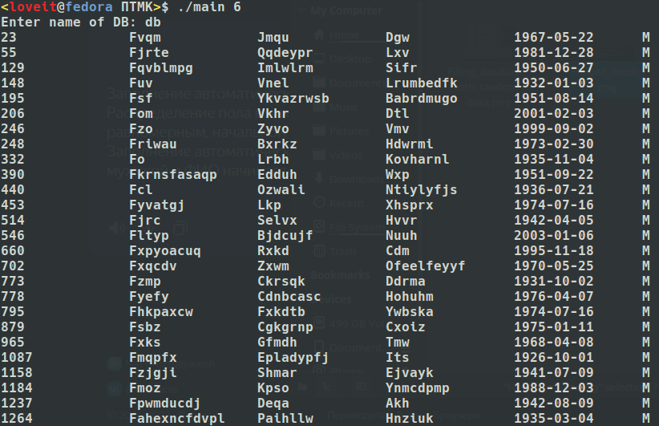
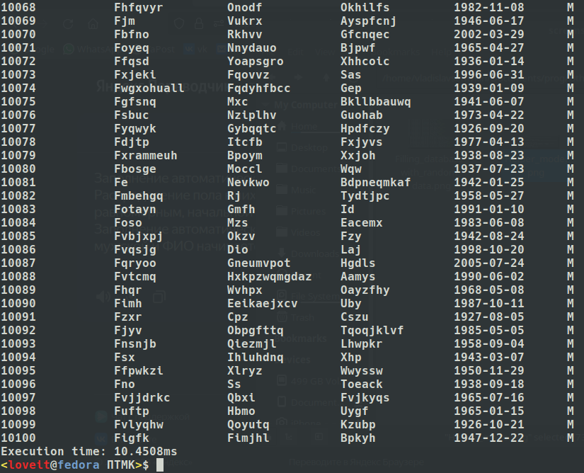
